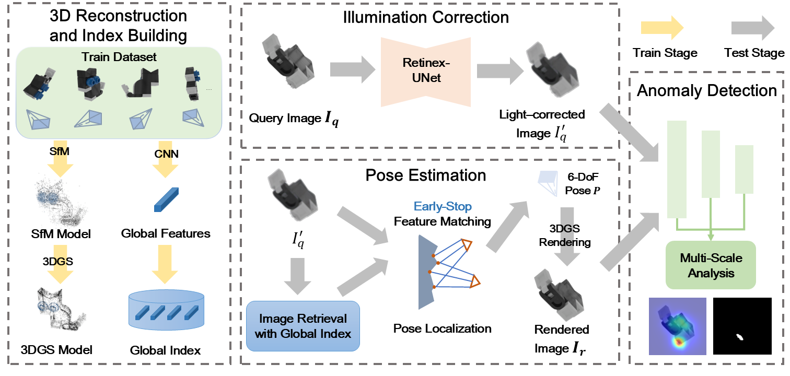

# Pose-Agnostic Anomaly Detection with Retinex-based Illumination Correction
This is the official code for the paper 
[**"Pose-Agnostic Anomaly Detection with Retinex-based Illumination Correction"**](https://papers.ssrn.com/sol3/papers.cfm?abstract_id=6055450)
by Yuji Wang, Ran Yi, et al.




## Abstract:
>Traditional industrial anomaly detection datasets, such as MVTec-2D and MVTec-3D, are typically based on a fixed-pose assumption.  However, in real-world scenarios, to achieve more thorough detection, a wide variety of object poses are often involved. While recent works try to address this challenge, they still struggle with detection accuracy and hard cases like reflective surfaces. In this paper, we propose $R^3\_PAD$, integrating **R**etinex-based illumination correction, **R**eal-time pose estimation, and **R**obust multi-scale anomaly detection. First, to bridge the potential illumination differences between 3D reconstructed models and real-world scenes, we propose Retinex-UNet to correct illumination for enhanced robustness in diverse lighting. Second, we design a multi-scale analysis (MSA) module that combines shallow and deep features for precise anomaly detection. Finally, to further improve efficiency, we introduce an early-stop mechanism to accelerate keypoint matching in the pose estimation framework, improving efficiency without compromising accuracy. 
Extensive experiments demonstrate the superiority of $R^3\_PAD$, achieving Image-AUROC of 97.9\% and Pixel-AUPRO of 97.2\%. Ablation studies validate the effectiveness of each component, and we further show the scalability of Retinex-UNet when applied to diverse scenarios.


## Installation Setup
We have tested on a Linux machine with Torch 2.5 and Cuda 12.4. If you use gcc-13, please include \<cstdint\> in "submodules/diff-gaussian-rasterization/cuda_rasterizer/rasterizer_impl.h"

```shell
# (1) Cloning the repository and the submodules recursively
git clone git@github.com:Yizhe-Liu/SplatPosePlus.git --recursive
cd SplatPosePlus

# (2) Create the environment with necessary CUDA & PyTorch frameworks
export CUDA_HOME=/usr/local/cuda
conda env create --file environment.yml 
conda activate splatposeplus
pip install -e submodules/Hierarchical-Localization/

# (3) Download MAD-Sim Dataset
gdown 1XlW5v_PCXMH49RSKICkskKjd2A5YDMQq
unzip MAD-Sim.zip

# (4) Download the pretrained model checkpoints from the PAD repository
cd PAD_utils
gdown https://drive.google.com/uc\?id\=16FOwaqQE0NGY-1EpfoNlU0cGlHjATV0V
unzip model.zip
cd ..
```

### Running Anomaly Detection
To run SplatPose+ on the first class "01Gorilla" of MAD, simply run
```shell
python train_render_eval.py -c 01Gorilla
```
Run ```python train_render_eval.py --help``` to find other options and flags. 


### Credits
Our work is based on the following works: 
- [SplatPose](https://github.com/m-kruse98/SplatPose)
- [3D Gaussian Splatting for Real-Time Radiance Field Rendering](https://github.com/graphdeco-inria/gaussian-splatting)
- [PAD: A Dataset and Benchmark for Pose-agnostic Anomaly Detection](https://github.com/EricLee0224/PAD)
- [Hierarchical-Localization](https://github.com/cvg/Hierarchical-Localization)

### License
The gaussian-splatting module is licensed under the respective "Gaussian-Splatting License" found in LICENSE.md.
